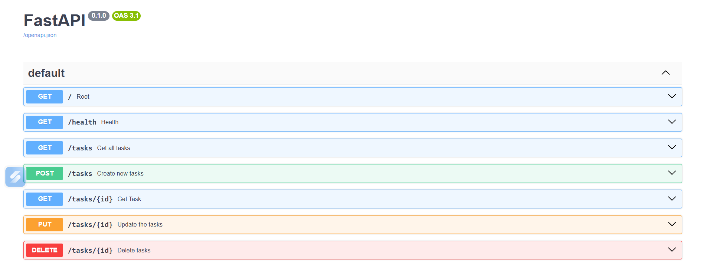

# FastAPI Task Manager API

A simple CRUD (Create, Read, Update, Delete) REST API built using **FastAPI**. This project demonstrates the basic concepts of REST APIs, routing, request validation, HTTP status codes, and Swagger UI.

## Features

- Create a new task
- Get all tasks
- Get a task by ID
- Update a task
- Delete a task
- Automatic API documentation with Swagger UI

## Tech Stack

- Python 3
- FastAPI
- Uvicorn

## Installation

### 1. Clone the repository

```bash
git clone https://github.com/your-username/fastapi-task-api.git
cd fastapi-task-api
```

### 2. Create a virtual environment (Optional)

```bash
python -m venv venv
```

Activate the virtual environment:

**Windows**

```bash
venv\Scripts\activate
```

**Linux / macOS**

```bash
source venv/bin/activate
```

### 3. Install dependencies

```bash
pip install fastapi uvicorn
```

### 4. Run the application

```bash
uvicorn main:app --reload
```

The server will start at:

```
http://127.0.0.1:8000
```

## Swagger Documentation

Open your browser and visit:

```
http://127.0.0.1:8000/docs
```

Interactive API documentation is automatically generated by FastAPI.

Alternative documentation:

```
http://127.0.0.1:8000/redoc
```

## API Endpoints

| Method | Endpoint | Description |
|--------|----------|-------------|
| GET | `/tasks` | Get all tasks |
| GET | `/tasks/{id}` | Get a task by ID |
| POST | `/tasks` | Create a new task |
| PUT | `/tasks/{id}` | Update an existing task |
| DELETE | `/tasks/{id}` | Delete a task |

---

## Example Request

### Create Task

**POST** `/tasks`

```json
{
    "title": "Learn FastAPI"
}
```

Response

```json
{
    "id": 1,
    "title": "Learn FastAPI",
    "done": false
}
```

---

### Update Task

**PUT** `/tasks/1`

```json
{
    "title": "Complete FastAPI Project",
    "done": true
}
```

---

### Delete Task

**DELETE** `/tasks/1`

Returns:

```
204 No Content
```

---

## HTTP Status Codes

| Status Code | Meaning |
|-------------|---------|
| 200 | Success |
| 201 | Resource Created |
| 204 | Successfully Deleted (No Content) |
| 400 | Bad Request |
| 404 | Task Not Found |

## Project Structure

```
fastapi-task-api/
│
├── main.py
├── README.md
└── __pycache__/
```

## Learning Outcomes

This project helped me understand:

- FastAPI routing
- CRUD operations
- Path parameters
- Request body handling
- HTTPException
- Response objects
- HTTP status codes
- Swagger UI documentation

## Author

**Shlok Tiwari**

GitHub: https://github.com/your-username
LinkedIn: https://linkedin.com/in/your-profile
